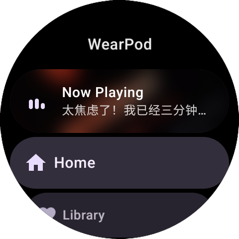
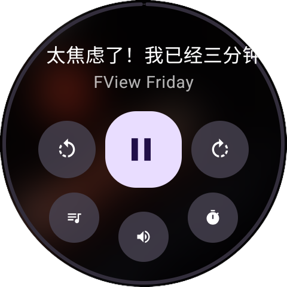
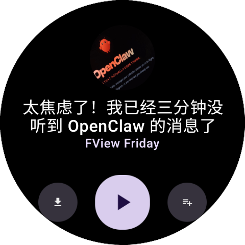
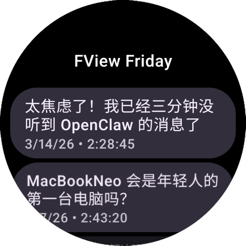
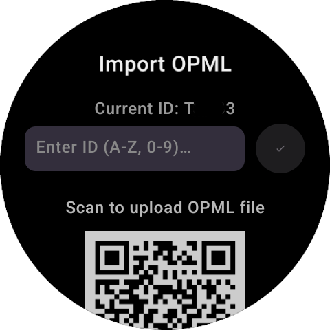

  

<h1 align="center">WearPod</h1>

    

---

WearPod 是一款专为**安卓手表**设计的泛用型播客客户端。

## 📸 界面预览

   
 
  

## ✨ 功能特性

- 独立使用：使用手机蓝牙网络或手表独立eSim，在手表上播客节目的拉取、播放、下载播客节目；
- 离线收听：支持将节目下载至本地存储，告别断网焦虑；
- 支持播客节目ShowNote显示；
- 支持播客播放进度断点记忆；
- 在播放页右侧滑动可调节播放进度；
- 支持睡眠定时；
- 使用与小米Watch5、OPPO X2等非Google组件不全的安卓手表；

## ⌚ 使用方法

- 通过adb方式安装到手表
- 从你手机端常用的播客软件导出OPML订阅文件，上传到[这里](https://pod-upload.whitezaak.site/)，获取独一无二的订阅id
- 打开WearPod的设置页 => Import OPML输入订阅id

- 畅听播客🎵

## ✅ TODO

- [ ] 适配小米手表（国内版）旋转表冠震动反馈
- [ ] 软件性能优化
- [ ] 更优雅的订阅同步方式

